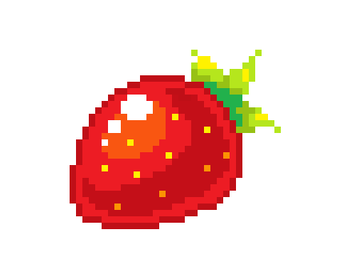

    

<h1>Agência XYZ</h1>

Projeto desenvolvido nas aulas de HTML e CSS no curso DevQuest do Dev em Dobro.

### 🚀 Tecnologias Utilizadas:

    
    
    

### 🎬 Preview Mobile:

### 🎬 Preview Desktop:
